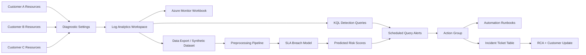

# Azure MSP Operations Center

Multi-tenant Azure monitoring, incident response, and SLA breach prediction platform for MSP-style cloud operations.

This project is designed for Cloud Support Engineer, Azure Support, Cloud/IT Systems Administrator, and Junior Azure Administrator portfolios. It focuses on the work support teams actually do: detect incidents, investigate logs, control access, automate response, document RCA, and communicate clearly with customers.

## Scenario

An MSP manages three customer environments:

| Customer | Workload | Criticality | Example Resources |
| --- | --- | --- | --- |
| Contoso Retail | E-commerce web app | High | App Service, Azure SQL, Storage |
| Fabrikam Clinic | Appointment portal | High | App Service, SQL, Key Vault |
| Northwind Campus | Internal IT systems | Medium | VMs, Storage, Log Analytics |

The MSP needs a central operations center that can:

- Collect platform, application, identity, and cost signals.
- Detect incidents with KQL-based Azure Monitor rules.
- Predict SLA breach risk from historical operational signals.
- Trigger support runbooks and customer communication templates.
- Produce RCA documents after each incident.

## Architecture



## What This Demonstrates

| Area | Evidence in this repo |
| --- | --- |
| Azure Support | KQL investigations, RCA reports, customer update templates |
| MSP Operations | Customer tagging, multi-customer workbook, escalation matrix |
| Azure Administrator | RBAC, Policy, Log Analytics, alerts, diagnostic settings |
| Systems Administration | VM heartbeat, disk, CPU, failed login, patch posture queries |
| Security Operations | Entra sign-in analysis, Key Vault access failures, Sentinel-ready detections |
| Data Team Collaboration | Preprocessing, feature engineering, SLA breach model, evaluation report |
| IaC / DevOps | Terraform scaffold, GitHub Actions validation workflow |

## Repository Structure

```text
azure-msp-operations-center/
  infra/terraform/        Azure resources for monitoring, policy, alerts
  kql/                    Investigation and detection queries
  workbooks/              Azure Workbook template scaffold
  runbooks/               Support automation scripts
  data/                   Synthetic incident dataset
  ml/                     Preprocessing, training, scoring, evaluation
  incidents/              RCA examples
  docs/                   Architecture, RBAC, security, cost, support playbook
  scripts/                Local utilities
```

## Core Deliverables

- Central Log Analytics Workspace design.
- Azure Monitor scheduled query alert definitions.
- KQL query pack for App Service, SQL, VM, Identity, and Cost incidents.
- Azure Workbook JSON scaffold for customer operations review.
- Synthetic dataset generator for support incidents.
- SLA breach prediction pipeline using operational features.
- Automation runbooks for common remediation workflows.
- RCA documents for realistic support incidents.
- RBAC, security governance, cost governance, and escalation documentation.

## Quick Start

Generate synthetic support data and train the SLA breach model:

```bash
cd azure-msp-operations-center
python3 scripts/generate_synthetic_incidents.py
python3 ml/train_sla_model.py
python3 ml/score_incidents.py
```

Validate Terraform syntax when Terraform is installed:

```bash
cd azure-msp-operations-center/infra/terraform
terraform init
terraform validate
```

## Portfolio Talking Points

- I designed an MSP-style Azure operations center around incident detection, triage, escalation, and postmortem workflows.
- I used KQL to investigate practical support scenarios: App Service 5xx spikes, SQL saturation, VM heartbeat loss, suspicious sign-ins, and cost anomalies.
- I created a data pipeline that transforms operational telemetry into SLA breach risk features.
- I documented support-ready RCA and runbook artifacts, not only infrastructure code.
- I used least-privilege RBAC and governance controls to align with real customer-managed environments.

## Status

Initial portfolio scaffold. The project is intentionally structured so it can be expanded into a deployable Azure environment with real diagnostic logs, Azure Lighthouse delegation, and Microsoft Sentinel content.
